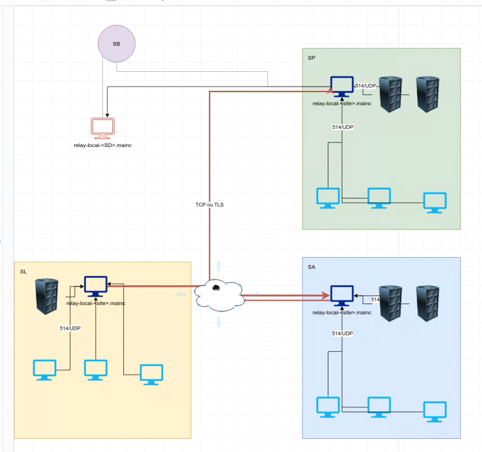
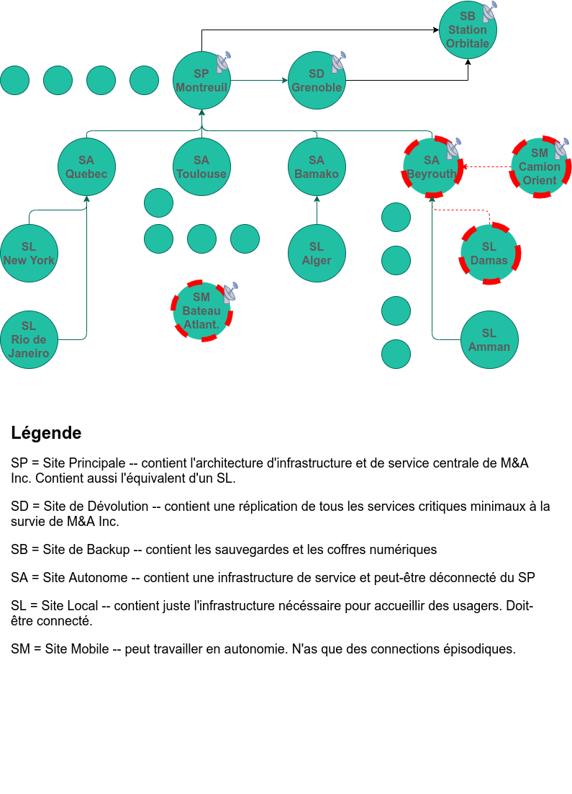

# Architecture logs management M&A Inc.

## Vocabulaire

| Mot utilisé | Explication |
| ------------------------- | ------------------------- |
| SB | Site de Backup |
| SP | Site Principal |
| SD | Site de Dévolution |
| SA | Site Autonome |
| SL | Site Local |
| SM | Site Mobile  |
| relay-[SB|SP|SD|SA|SL|SM] | Serveur Syslog du site en question |


## Contexte

> Vous été mandaté par l'entreprise Mercenaires & Associés Inc. (M&A Inc.) pour rénover le système de rénovation.
> Le client vous a donné les schémas de leur infrastructure actuelle.


## Architecture actuelle
Schéma de l'infrastructure de M&A Inc. :


Schéma de l'implantation des sites :


### Explication

Les particularité des divers sites :
Type de site | Nom complet du site | Explication | Particularité |
| ------------- | ------------- | ------------- | ------------- |
SB | Site de Backup | Site de backup des sauvegardes et coffres numériques |
SP | Site Principal | Site central de l'infrastructure et de service de M&A Inc. |
SD | Site de Dévolution | Site de survie de M&A Inc., contient une réplication de l'infrastructure et services nécessaires en cas de coupure sur SP |
SA | Site Autonome | Site contenant une infrastructure autonome | Peut être déconnecté du SP |
SL | Site Local | Site local ne contenant que l'infrastructure "utilisateurs" | Doit être connecté au SA ou SP |
SM | Site Mobile | Site fonctionnant en autonomie | N'a que des connections épisodiques au SP |

Sur la partie logs management, la hierarchie est telle quelle suivant les sites :
* relay-SL envoie tous les logs au relay-SA ou relay-SP auquel il est connecté.
* relay-SA peut stocker une certaine quantité de logs. Il envoie les logs au SP lorsqu'il le peut.
* relay-SM peut stocker les logs en local. **METTRE QUELQUE CHOSE POUR L'ENVOIE DES LOGS LORSQU'IL EST CONNECTE**
* relay-SP stocke les logs pendant un certain temps. Réplique sa base de donnée dans le relay-SD.
* relay-SB est le serveur syslog ayant tous les logs d'une durée de moins de 7 ans en sauvegarde.

### Architecture et solutions choisies

Nous avons choisi de respecter la hierarchie entre les sites.
* Les relay-SL envoient les logs aux relay-SA,
* Les relay-SA envoient les logs au relay-SP,
* Les relay-SM envoient les logs au relay-SP,
* Le relay-SP réplique ses logs au relay-SD,
* Les relay-SP et relay-SD envoient leurs logs au relay-SB pour la sauvegardes des logs.
Le coeur syslog est donc le site ``SP``. ``SD`` étant en réplication et ``SB`` le site de backup.

Les envois de logs se font en TCP sur le port 6514, chiffrés en TLS. Pour cela il faut diposer d'une infrastructure CA.

#### Partie CA

Pour tester l'architecture, nous avons utilisé l'outil `openssl`.
Voici un example des commandes :
```bash
cd CA
mkdir certs crl newcerts private
echo "01" > serial
cp /dev/null index.txt
cp /etc/ssl/openssl.cnf openssl.cnf
# Changer la ligne
# [ CA_default ]
# dir             = ./demoCA              # Where everything is kept
# certs           = $dir/certs            # Where the issued certs are kept
# en 
# [ CA_default ]
# dir             = .                     # Where everything is kept
# certs           = $dir/certs            # Where the issued certs are kept

# Generer le certificat de la CA
openssl req -new -x509 -keyout private/cakey.pem -out cacert.pem -days 365 -config openssl.cnf

# Generer les certificat des clients
nomSite=relay-sa
openssl req -nodes -new -x509 -keyout $nomSitekey.pem -out $nomSitereq.pem -days 365 -config openssl.cnf
openssl x509 -x509toreq -in $nomSitereq.pem -signkey $nomSitekey.pem -out tmp$nomSite.pem
openssl ca -config openssl.cnf -policy policy_anything -out $nomSitecert.pem -infiles tmp$nomSite.pem
rm tmp$nomSite.pem
```

**Attention** : Ne pas oublier 
```bash
ln -s /etc/syslog-ng/ca.d/cacert.pem /etc/syslog-ng/ca.d/$(openssl x509 -noout -hash -in /etc/syslog-ng/ca.d/cacert.pem).0
```

Il faut mettre les fichiers ``$nomSitekey.pem`` et ``$nomSitecert.pem`` dans le repertoire ``/etc/syslog-ng/cert.d/`` et ``cakey.pem`` dans le repertoire ``/etc/syslog-ng/ca.d/``.

#### Partie sauvegarde des logs

Les logs enregistrés en local seront tous sauvegardés dans le répertoire parent ``/var/log/syslog-ng/``, dans le repertoire ``ANNEE.MOI.JOUR/``. Il y aura donc un repertoire par jour dans le dossier ``/var/log/syslog-ng/``. Enfin, un fichier log sera enregistré par site.
Dans le cas du site de backup, un dossier ``/var/log/syslog-ng/archive`` sera créé et les logs comppréssés seront dedans.

Par exemple nous pourrions retrouver l'arborescence ci-dessous sur un ``SA`` :
```bash
$ tree /var/log/syslog-ng/
/var/log/syslog-ng
├── 2020.10.22
│   ├── logs_SA-QUEBEC.log
│   ├── logs_SL-NYC.log
│   └── logs_SL-RIO.log
└── 2020.10.23
    ├── logs_SA-QUEBEC.log
    ├── logs_SL-NYC.log
    └── logs_SL-RIO.log
```

Exemple sur un site ``SP``, ``SD`` :
```bash
$ tree /var/log/syslog-ng/
/var/log/syslog-ng
├── 2020.10.22
│   ├── logs_SA-QUEBEC.log
│   ├── logs_SB-SAT.log
│   ├── logs_SD-GRENOBLE.log
│   ├── logs_SM-BATEAU.log
│   ├── logs_SL-NYC.log
│   ├── logs_SL-RIO.log
│   └── logs_SP-MONTREUIL.log
└── 2020.10.23
    ├── logs_SA-QUEBEC.log
    ├── logs_SA-TOULOUSE.log
    ├── logs_SB-SAT.log
    ├── logs_SD-GRENOBLE.log
    ├── logs_SL-NYC.log
    ├── logs_SL-RIO.log
    └── logs_SP-MONTREUIL.log
```

Et sur un site ``SB`` :
```bash
$ tree /var/log/syslog-ng/
/var/log/syslog-ng
├── 2020.10.22
│   ├── logs_SA-QUEBEC.log
│   ├── logs_SB-SAT.log
│   ├── logs_SD-GRENOBLE.log
│   ├── logs_SM-BATEAU.log
│   ├── logs_SL-NYC.log
│   ├── logs_SL-RIO.log
│   └── logs_SP-MONTREUIL.log
├── 2020.10.23
|   ├── logs_SA-QUEBEC.log
|   ├── logs_SA-TOULOUSE.log
|   ├── logs_SB-SAT.log
|   ├── logs_SD-GRENOBLE.log
|   ├── logs_SL-NYC.log
|   ├── logs_SL-RIO.log
|   └── logs_SP-MONTREUIL.log
└── archive
    ├── 2018.10.21.bz2
    └── 2018.10.22.bz2
```

Les relays des sites de type ``SA`` enregistrerons leur logs en local pour une durée de 2 ans.  
Les relays des sites de type ``SP`` et ``SD`` enregistrerons leur logs en local pour une durée totale de 7 ans. Au bout de 2 ans les logs seront compressés au format bzip2 (format de compression choisi par son rapport de taux de compression / temps).
Pour le site de backup ``SB``, par sa fonction de backup, sauvegardera aussi les logs pendant 7 ans dans le format bzip2.
Les relays des sites de type ``SM`` enregistreront leur logs en local jusqu'au moment où ils seront connectés au site SP. Ils envoieront leur logs mais en flux non prioritaire poour eviter de ralentir les applications du client prioritaires.
Les sites dit ``SL``, les relays n'auront pas de logs en local car ils sont forcement connecté à un site dit ``SA``.


Les opérations de compression et suppression des logs se font à l'aide de script bash. Syslog-ng ne conseille pas l'utilisation de logrotate pour une infrastructure syslog centralisé.
Les scripts bash des relay des site ``SA``, ``SP / SD`` et ``SB`` supprimeront les logs respectivement au bout de 2, 7 et 7 ans. De plus le script bash du ``SB`` comprimera les logs de plus de 2 ans. Ils seront lancés tout les jours à l'aide de cronjobs.


#### Les spécifités des configuration syslog-ng.conf

Le failover : le failover est configuré en mode fallback (retour au plus vite vers le site primaire (ici, le ``SP``)).

Site | Serveur Primaire destination | Serveur Secondaire destination | Serveur Tertiaire destination |
| ------------ |:------------:| ------------ | ------------ |
| ``SA`` | ``SP`` | ``SD`` | ``SB`` |
| ``SM`` | ``SP`` | ``SD`` | ``SB`` |
| ``SL`` | ``SA`` | ``SP`` | ``SD`` |

Buffer des logs : Un buffer de logs est configuré (en mode reliable) pour pallier les pertes de logs lors d'envoi/failover.


Filtres : @Théo Sigari


## Annexes

### Récapitulatif des emplacements des fichiers

|  | Emplacement |
| ------------ | ------------ |
|configuration syslog|``/etc/syslog-ng/syslog-ng.conf``|
|certificat CA|``/etc/syslog-ng/ca.d/cacert.pem``|
|certificat client|``/etc/syslog-ng/cert.d/relay<nomSite>cert.pem``|
|clé client|``/etc/syslog-ng/cert.d/relay<nomSite>key.pem``|
|logs|``/var/log/syslog-ng/``|
|script bash cron|``
