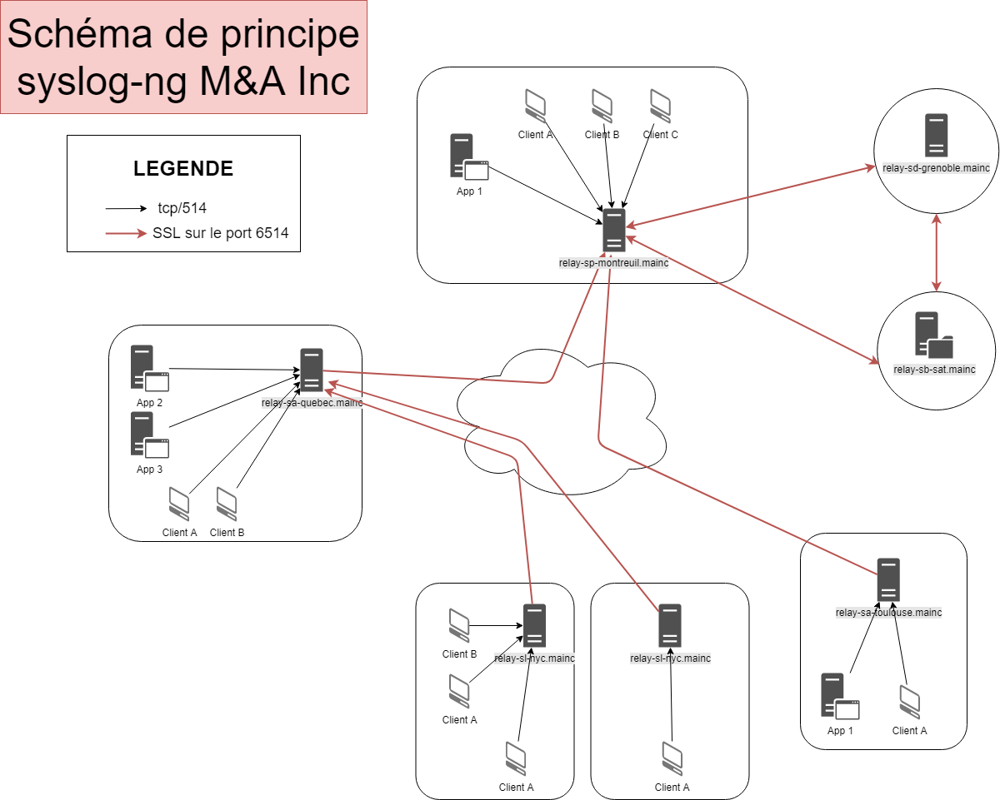

# SPECS M&A Inc
> Auteurs :
>   David DESCHAMPS
>   David MONTEIRO
>   Théo LAW BO KANG
>   Théo SIGARI
>   Romain BOIREAU

Schéma de principe :

## Spécificités des sites

Les particularité des divers sites :
Type de site | Nom complet du site | Explication | Particularité |
| ------------- | ------------- | ------------- | ------------- |
SB | Site de Backup | Site de backup des sauvegardes et coffres numériques |
SP | Site Principal | Site central de l'infrastructure et de service de M&A Inc. |
SD | Site de Dévolution | Site de survie de M&A Inc., contient une réplication de l'infrastructure et services nécessaires en cas de coupure sur SP |
SA | Site Autonome | Site contenant une infrastructure autonome | Peut être déconnecté du SP |
SL | Site Local | Site local ne contenant que l'infrastructure "utilisateurs" | Doit être connecté au SA ou SP |
SM | Site Mobile | Site fonctionnant en autonomie | N'a que des connections épisodiques au SP |

Sur la partie logs management, la hierarchie est telle quelle suivant les sites :
* relay-SL envoie tous les logs au relay-SA ou relay-SP auquel il est connecté.
* relay-SA peut stocker une certaine quantité de logs. Il envoie les logs au SP lorsqu'il le peut.
* relay-SM peut stocker les logs en local. Et envoie les logs lorsqu'il est connecté.
* relay-SP stocke les logs pendant un certain temps. Réplique sa base de donnée dans le relay-SD.
* relay-SB est le serveur syslog ayant tous les logs d'une durée de moins de 7 ans en sauvegarde.
